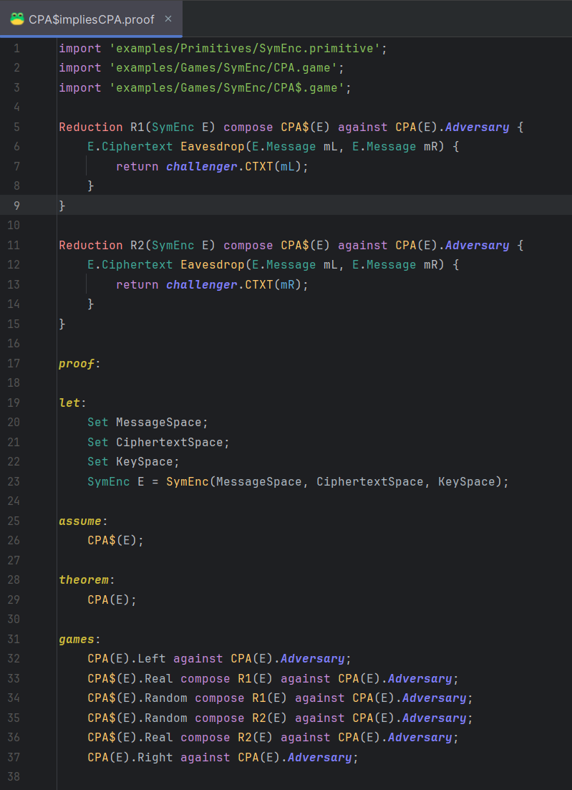
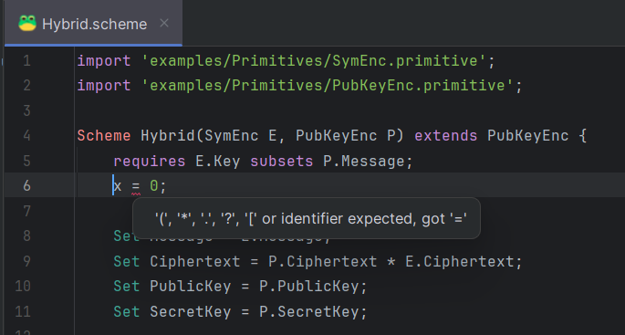
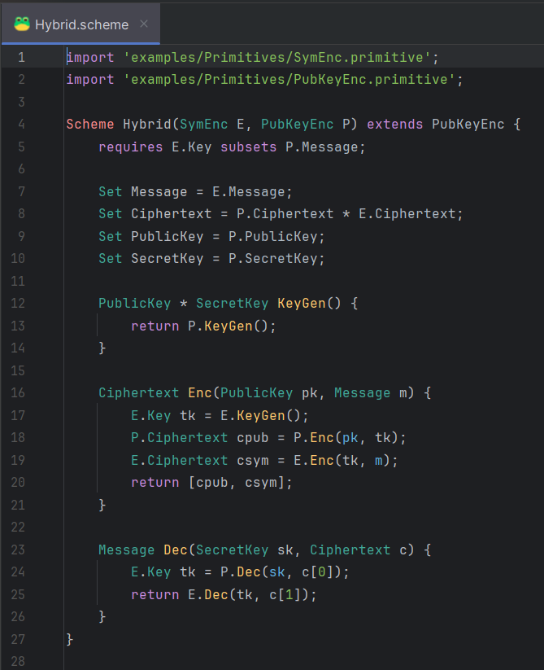
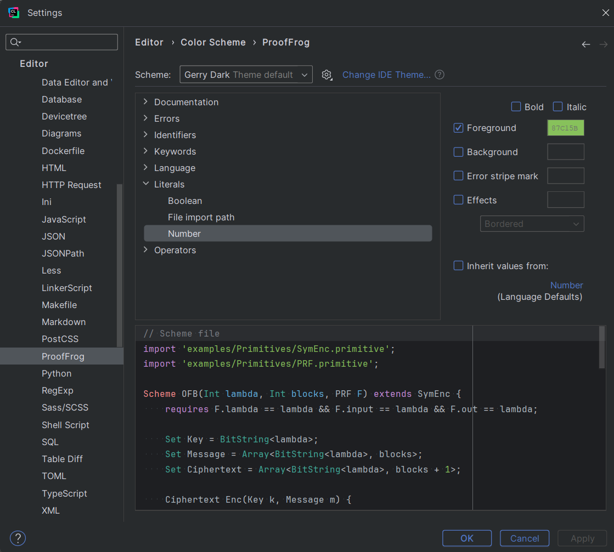
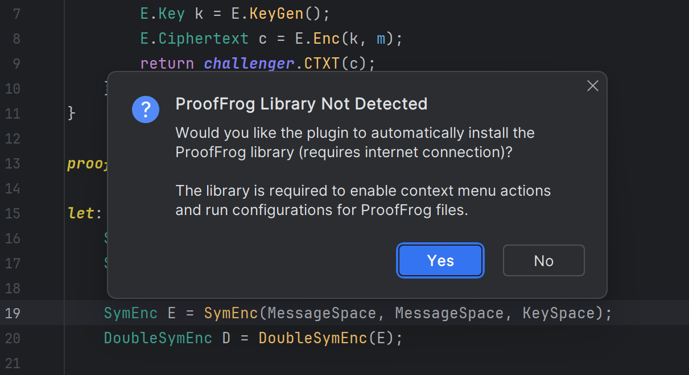
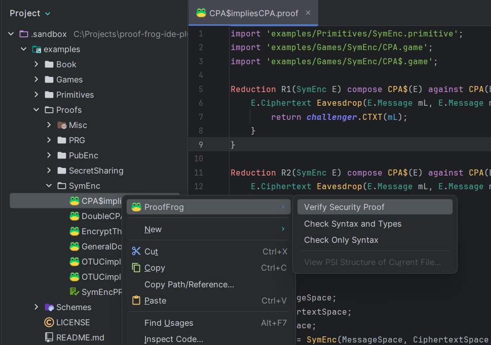
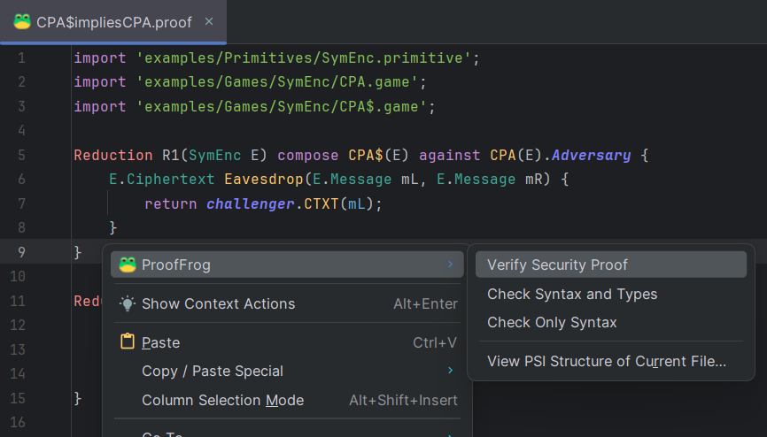
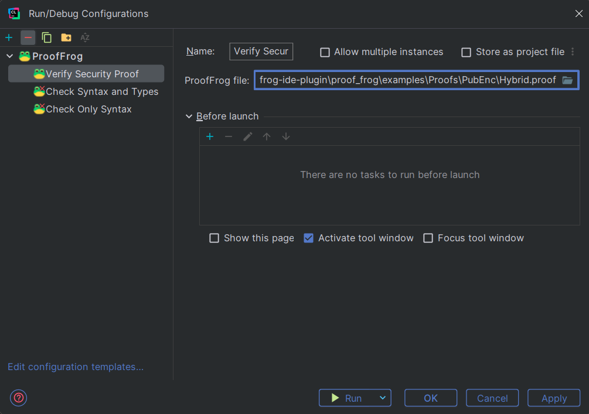
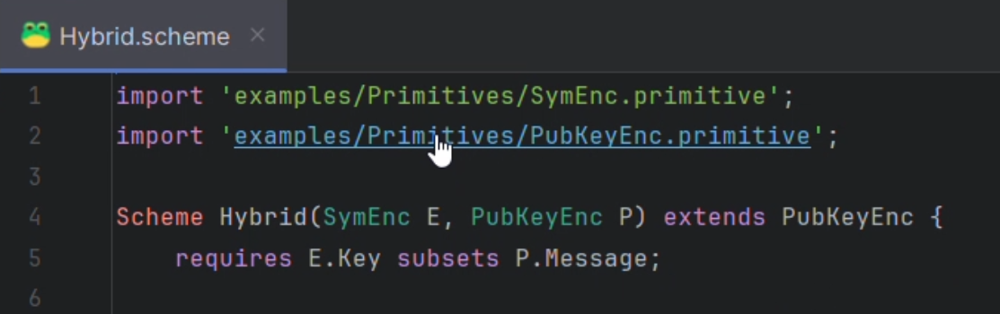

# ProofFrog Plugin for JetBrains IDE-s


## Table of Contents

1) [Description](#description)
2) [Current Features](#current-features)
3) [Roadmap](#Roadmap)
4) [ProofFrog Library Installation](#prooffrog-library-installation)
5) [Parser Differences](#parser-differences)
6) [Plugin Development](#plugin-development)
7) [Gallery](#gallery)

<br/>


## Description
**[ProofFrog](https://github.com/ProofFrog/ProofFrog)** is a work-in-progress tool for verifying cryptographic game-hopping proofs.  
All security properties in ProofFrog are written via pairs of indistinguishable games.

This plugin aims to provide syntax highlighting, annotations, code completion, and other features   
for the ProofFrog [Domain Specific Language](https://en.wikipedia.org/wiki/Domain-specific_language), which is described in detail in the [thesis paper](https://dspacemainprd01.lib.uwaterloo.ca/server/api/core/bitstreams/b0056349-bcb8-4d69-8b45-dd3808e945d0/content).

This plugin is compatible with all JetBrains IDE-s and if you are doing active cryptography R&D,  
we wholeheartedly recommend you to use their [CLion IDE](https://www.jetbrains.com/clion/), which since `May 7, 2025` has become  
**Free for Non-Commercial Use**.

<br/>

<br/>


## Current Features

1) [Syntax validation](#syntax-validation)
2) [Syntax highlighting](#syntax-highlighting)
3) [Color settings menu](#color-settings-menu)
4) Comment with Line Comment action
5) [Automatic setup of ProofFrog Python library](#library-setup)
6) [Project explorer context menu](#project-explorer-context-menu)
7) [Editor context menu](#editor-context-menu)
8) [Run configurations](#run-configurations)
9) [Ctrl+Click of import statement file paths](#import-references)

[⬆️ Back to top](#prooffrog-plugin-for-jetbrains-ide-s)
<br/>
<br/>


## Roadmap

If you want these goals to get done, then please ⭐ Star this repository to indicate your need for  
this software. You can also participate in the [discussions](https://github.com/aabmets/proof-frog-ide-plugin/discussions) 
to propose other features for the ProofFrog  
plugin or make a pull request against this repository with your implemented changes.

1) General reference contributor
2) Completion contributor
3) Go To Symbol contributor
4) Find usages provider
5) Folding builder

[⬆️ Back to top](#prooffrog-plugin-for-jetbrains-ide-s)
<br/>
<br/>


## ProofFrog Library Installation

When you first install the plugin into a JetBrains IDE, it will try to locate a Python virtual environment with  
the [proof_frog](https://pypi.org/project/proof_frog/) library installed. If it fails to do so, you will be prompted 
with a confirmation popup asking if  
you want the plugin to download and install it for you.  

If you choose Yes, the plugin first downloads the latest release of [Astral UV](https://github.com/astral-sh/uv) package manager into the plugin   
directory, then uses it to download a Python version, then uses it to create a private Python virtual environment  
into the plugin directory and finally installs `proof_frog` from the Python Package Index into the venv.

If you choose No, you can still enable the context-menu actions and run configurations of the plugin by manually  
creating a Python virtual environment named either `venv` or `.venv` at the top level of your project directory and  
installing `proof_frog` into it. Once you have done that, the plugin will detect and use your manual `proof_frog`  
library installation when you restart the IDE.  

The manual installation solution is also useful for developing the `proof_frog` library itself in [PyCharm](https://www.jetbrains.com/pycharm/), because  
you can install the library into the venv in editable mode and then use the plugin actions to test the modified library.

[⬆️ Back to top](#prooffrog-plugin-for-jetbrains-ide-s)
<br/>
<br/>


## Parser Differences

There is a minor difference in how this plugin parses ProofFrog code compared to the ProofFrog library itself.  
Namely, this plugin **does not** and **will not** allow the keyword `in` as class field names, so you might get parsing  
errors when opening some ProofFrog example files which contain `Int in = in;` or `requires F.in == F.out;`.  
This syntax is forbidden because literally all real programming languages forbid the usage of reserved keywords  
as identifiers, and it does not make sense to deviate from this standard.

[⬆️ Back to top](#prooffrog-plugin-for-jetbrains-ide-s)
<br/>
<br/>


## Plugin Development

This plugin must be developed with IntelliJ IDEA IDE (Community or Ultimate).  
Development of this plugin requires the `Grammar-Kit` and `Plugin DevKit` plugins from the IDE marketplace.

Do once per IDE:  
In the top navbar, go to `Help -> Edit Custom Properties...` and insert  
`idea.is.internal=true` into the `idea.properties` file, if it's not there yet.

To pull in ProofFrog examples from the nested submodule, run these commands:
```shell
cd proof_frog
git submodule set-url examples https://github.com/ProofFrog/examples.git
git submodule sync
cd ..
git submodule update --init --recursive
```
 
To modify the syntax rules of this plugin, modify the `ProofFrog.bnf` and `ProofFrog.flex` files in  
sources root directory at `src/main/java/io/github/aabmets/prooffroglang`.

Then in `ProofFrog.bnf` context menu select `Generate Parser Code` and in `ProofFrog.flex` context menu  
select `Run JFlex Generator`, then use the generated PSI elements in any number of ProofFrog source files  
to implement the plugin behavior.

[⬆️ Back to top](#prooffrog-plugin-for-jetbrains-ide-s)
<br/>
<br/>


## Gallery

### Syntax validation


[⬆️ Back to current features](#current-features)
<br/>
<br/>
<hr/>


### Syntax highlighting


[⬆️ Back to current features](#current-features)
<br/>
<br/>
<hr/>


### Color settings menu


[⬆️ Back to current features](#current-features)
<br/>
<br/>
<hr/>


### Library Setup


[⬆️ Back to current features](#current-features)
<br/>
<br/>
<hr/>


### Project explorer context menu


[⬆️ Back to current features](#current-features)
<br/>
<br/>
<hr/>


### Editor context menu


[⬆️ Back to current features](#current-features)
<br/>
<br/>
<hr/>


### Run configurations


[⬆️ Back to current features](#current-features)
<br/>
<br/>
<hr/>


### Import references


[⬆️ Back to current features](#current-features)
<br/>
<br/>